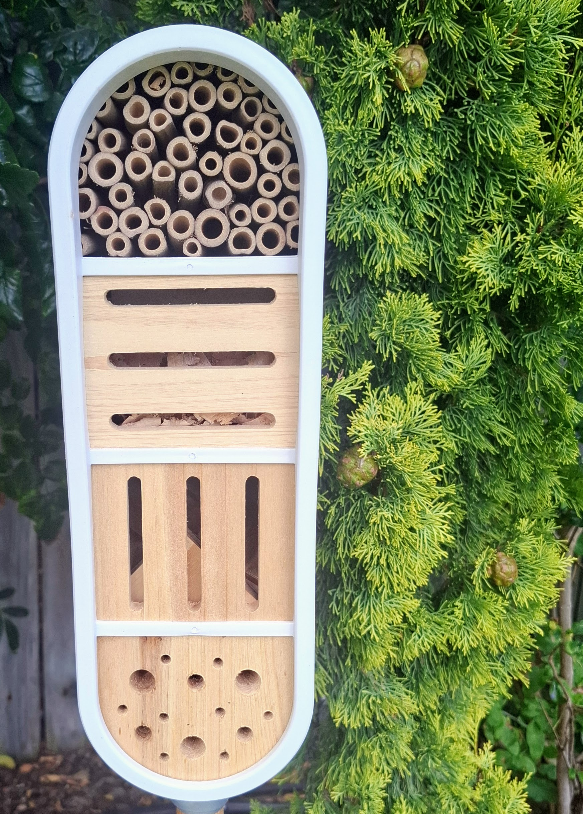
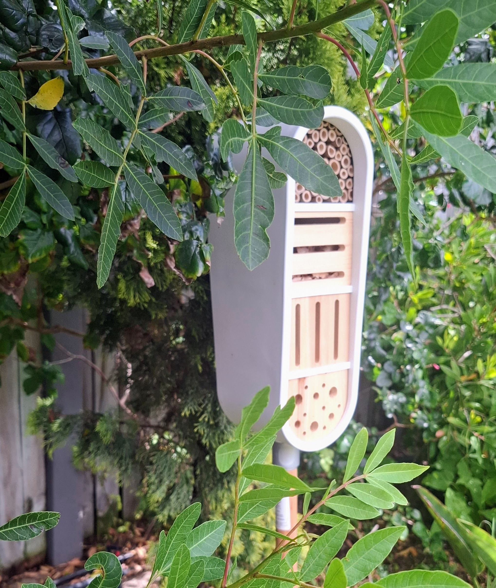

# Accommodation

Every room at The Insect Hotel is crafted from natural materials and designed
with a specific guest in mind. Whether you prefer a snug tunnel, a cosy crevice,
or an airy bundle of hollow stems, we have something for you.

{ width="100%" }

---

## Room Types

### :material-tunnel: The Bamboo Suite

**Best for:** Solitary bees, small wasps

Bundles of hollow bamboo canes in a range of diameters (2mm–10mm). South-facing
for morning warmth. Each tube is a private, single-occupancy chamber — perfect
for nesting or simply resting between flights.

- Private entrance
- Naturally ventilated
- Seasonal sun exposure

---

### :material-pine-tree: The Pine Cone Loft

**Best for:** Ladybirds, lacewings, earwigs

Stacked pine cones create a labyrinth of cosy gaps and crannies. Sheltered from
wind, insulated against cold nights, and just complex enough to feel like an
adventure.

- Multiple entry points
- Excellent insulation
- Communal yet private

---

### :material-tree: The Bark Hideaway

**Best for:** Beetles, woodlice, spiders

Layers of loose bark provide dark, sheltered retreats for guests who prefer life
on the quiet side. Damp-tolerant and naturally textured.

- Low-light environment
- Moisture-retaining
- Ground-level access available

---

### :material-grass: The Straw Gallery

**Best for:** Solitary bees, beneficial wasps

Tightly packed straw and dried grass stems offer a warm, golden-hued retreat.
Excellent for overwintering and early-season nesting.

- Warm and dry
- Varied tube diameters
- Sheltered from prevailing winds

---

### :material-leaf: The Leaf Litter Lounge

**Best for:** Ground beetles, centipedes, overwintering butterflies

A generous layer of dried leaves, twigs, and moss at the base of the hotel. It's
not glamorous, but it's honest — and incredibly popular in the cooler months.

- Natural insulation
- Rich micro-ecosystem
- All-season availability

---

### :material-brick: The Drilled Log Rooms

**Best for:** Mason bees, solitary bees

Sustainably sourced hardwood logs with precision-drilled holes of varying depths
and diameters. Smooth interiors, no splinters. Our most sought-after rooms.

- Hand-finished chambers
- Ideal nesting depth
- Premium sun exposure

---

{ width="100%" }

## Facilities

All guests enjoy access to:

- **Open-air foraging grounds** — indigenous fynbos, wildflowers, and seasonal
  blooms within easy flying distance
- **Fresh water sources** — shallow dishes with pebble landing pads, refilled by
  rain or by management
- **Shelter from predators** — the hotel's design includes overhangs and
  recessed areas to reduce exposure
- **Shade trees nearby** — for those hot summer days when even an insect needs a
  break

---

!!! info "A note on availability"
    Rooms are allocated on a first-come, first-served basis. We don't take
    reservations — just arrive and find your spot. Peak season is spring and
    early summer, so early arrivals get the best choice.
