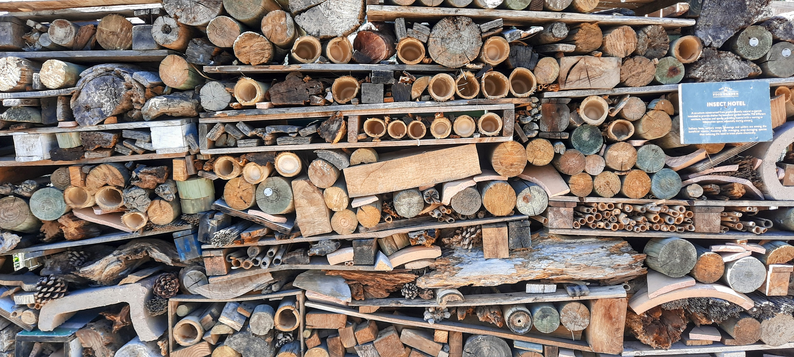

# The Story Behind Insect Hotels

**Where they came from, where they are, and why you should build one.**

{ width="100%" }

---

You're reading this because you're a human. We've covered that already. But the
fact that you're still here, curious about a hotel you can never check into,
says something good about you.

So here's the story.

---

## A Brief History of the Insect Hotel

The idea of giving insects a place to nest is older than you might think. But
the modern **insect hotel** as we know it first appeared in **Europe in the late
1980s and 1990s**, mainly in **Germany and the Netherlands**.

The problem was simple. Intensive forestry had tidied Europe's forests too well.
Dead wood was cleared. Log piles were removed. Hollow stems were mowed. The
untidy corners where solitary bees, wasps, and beetles had nested for thousands
of years were simply gone.

Forest managers began to realise, somewhat late, that the insects they'd cleared
out were the same ones pollinating crops and controlling pests. So they started
putting out drilled wooden blocks and bundles of hollow twigs as replacement
nesting sites. These early structures were built to work, not to look good. They
were apologies in timber.

By the **2000s**, insect hotels had spread across Europe. They evolved from
forestry tools into garden features, school projects, and public art. Groups
like **Buglife** in the UK and the **Scottish Wildlife Trust** championed them.
The idea crossed the Atlantic, appeared in Australia and South Africa, and became
one of the easiest ways to get involved in hands-on conservation.

Today, they are everywhere: in back gardens, on balconies, in schoolyards, at
wine estates, and in the courtyards of architecture museums. The humble insect
hotel has become a global movement.

---

## How Far the Idea Has Spread

Not all insect hotels are small garden projects. In March 2022, a conservation
company in the Scottish Highlands built a **199.9 cubic metre** structure from
felled Sitka spruce and bamboo, setting a **Guinness World Record**. In Helsinki,
architecture students built a pavilion you can sit inside that doubles as a
giant insect habitat. At the **Suzuka Formula 1 Circuit** in Japan, Sebastian
Vettel installed eleven insect hotels at Turn 2 and had each team customise
their own. The idea goes wherever people take it.

{ width="100%" }

Closer to home, **Boschendal** wine estate in Franschhoek runs an insect hotel
as part of its regenerative farming programme. It's a **WWF Conservation
Champion**, and the hotel sits in a landscape where fynbos, orchards, and
mountain slopes meet.

The full map, from Kew Gardens to Johannesburg, is on our
[Network](network.md) page.

### The corridor idea

Individual hotels help, but connected habitats transform. Across Europe and
beyond, people are linking gardens, parks, and rooftop plantings into
continuous pollinator corridors. **Buglife** in the UK is mapping
three-kilometre-wide insect pathways through every county. Oslo has a
citizen-driven **bee highway**. Seattle has a mile-long pollinator corridor
connecting a university campus to a pocket park, and the idea has since spread
to over 300 towns across 24 US states.

The point is always the same: **a single insect hotel helps, but a connected
network of habitats transforms**. Even a flowering window box becomes part of
something larger when it connects to its neighbours.

---

## Why You Should Build One

You can't check into The Insect Hotel. But you can build your own. Here's why
you should.

### :material-sprout: Because the habitat is vanishing

Insect numbers are falling everywhere, by an estimated **1 to 2.5 percent per
year**. Habitat loss, pesticide use, light pollution, and climate change are all
to blame. The tidy gardens, paved driveways, and neat lawns that humans prefer
are ecological deserts for insects. The fallen leaves, dead wood, and hollow
stems that insects need have been swept, cleared, and mowed away. An insect
hotel, even a small one, provides nesting and wintering habitat where none
existed before.

### :material-food-apple: Because your food depends on it

Solitary bees, hoverflies, and butterflies are behind roughly **75% of the
world's food crops**. Every solitary bee that nests in your insect hotel helps
with this work, and it's worth more than you'd think: in Europe alone,
pollination runs to at least **$25 billion** a year. A single red mason bee can pollinate
as much apple blossom as **120 honeybees**.

### :material-shield-bug: Because they're your garden's pest control

Insect hotels attract **lacewings**, whose larvae devour aphids by the hundred.
They attract **ladybirds**, each of which can eat up to **5,000 aphids** in its
lifetime. They attract **solitary wasps**, which hunt caterpillars, beetle
larvae, and other garden pests. An insect hotel is not just shelter; it's a
biological pest control system that works while you sleep.

### :material-school: Because they teach

An insect hotel in a school garden, a community space, or your own back yard is
a living lesson in ecology. Children (and adults) learn to watch, to name
species, to understand seasonal cycles, and to appreciate the remarkable
complexity of the small creatures that keep our ecosystems running.

### :material-hammer-wrench: Because anyone can do it

You don't need land. You don't need money. You don't need skill. A few bamboo
tubes bundled together and hung on a sunny wall is a perfectly good bee hotel. A
stack of old pallets filled with pine cones, bark, straw, and drilled logs is a
five-star insect block of flats. The materials are free. The build is forgiving.
And the guests are not fussy reviewers.

---

## Who Will Check In?

Build it, and they will come. Here's who you can expect.

| Guest | What they need | What they give back |
|-------|---------------|-------------------|
| :material-bee: **Solitary bees** (mason bees, leafcutter bees) | Hollow tubes (bamboo, drilled wood), 6–10 mm wide | Pollination, far more efficient per bee than honeybees |
| :material-ladybug: **Ladybirds** | Pine cones, bark gaps, dry leaves | Aphid control, up to 5,000 aphids per lifetime |
| :material-butterfly: **Lacewings** | Straw, rolled cardboard, bark strips | Larvae eat aphids, mites, and small caterpillars |
| :material-bee: **Solitary wasps** | Hollow tubes, drilled wood, 3–8 mm wide | Pest control: they hunt caterpillars and beetle larvae |
| :material-butterfly: **Butterflies** | Vertical slits in wood panels | Pollination, beauty, and a sign of ecosystem health |
| :material-bug: **Beetles** | Loose bark, dead wood, log sections | Breaking down dead plant material and enriching soil |
| :material-bug: **Earwigs** | Upturned pots filled with straw or hay | Pest control: they eat aphids, mites, and insect eggs |

---

## A Few Honest Warnings

Because we believe in honesty (see: [House Rules](house-rules.md)).

!!! note "Bigger is not always better"
    Research has shown that very large, tightly packed insect hotels can raise
    the risk of **disease and parasites** among residents. In nature, solitary
    bees nest in small, widely spaced groups. A modest hotel with well-chosen
    materials, cleaned once a year, works better than a huge structure left to
    rot.

!!! note "Location matters"
    Face your insect hotel **south to south-east** (in the Southern Hemisphere,
    north to north-east). Place it at least a metre off the ground, sheltered
    from the main wind and rain. Put it near **flowering plants**, especially
    native species with strong UV nectar guides that your future guests can
    actually see (even if [you cannot](not-an-insect.md)).

!!! note "Not all hotels attract the right guests"
    A 2020 study in Marseille found that urban bee hotels were mainly used by
    an **exotic bee species**, whose presence lined up with lower native bee
    numbers in the area. Pair your insect hotel with **native plantings** to
    support local species, not invasive ones.

---

## Start Small. Start Now.

You don't need to break a world record. You don't need a thousand hectares of
fynbos. You need a drill, a block of untreated hardwood, and ten minutes.

Drill holes between 6 and 10 mm wide, at least 10 cm deep, angled slightly
upward so rain drains out. Sand the entrances smooth. Fix the block to a sunny,
sheltered wall. Wait.

Within weeks, sometimes days, a solitary bee will find it. She'll check the
holes, choose one, stock it with pollen, lay an egg, and seal the entrance with
mud or leaf bits. By next spring, a new generation will come out.

You'll have built a hotel. A tiny one. But a real one.

And somewhere, on a wine estate in Franschhoek, on a nature reserve in the
Scottish Highlands, in a courtyard in Helsinki, and in thousands of gardens in
between, the network grows.

---

!!! tip "Want to see what your guests see?"
    Take the [UV verification challenge](verify.md) and find out why you'll
    never pass the check-in test.

[Book Now](verify.md){ .book-button }

