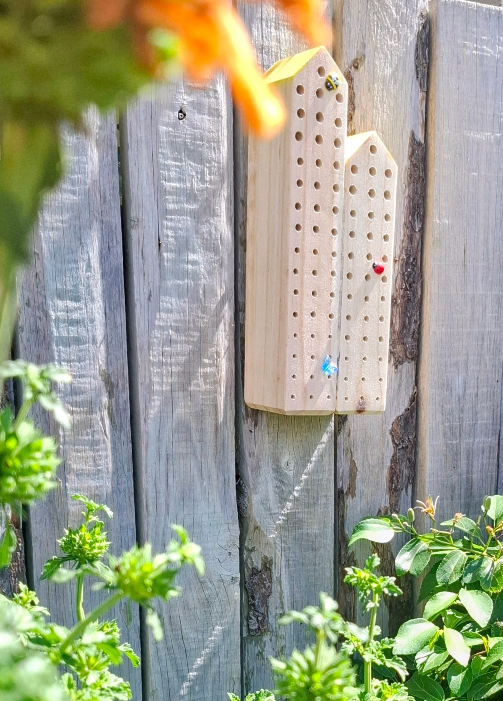
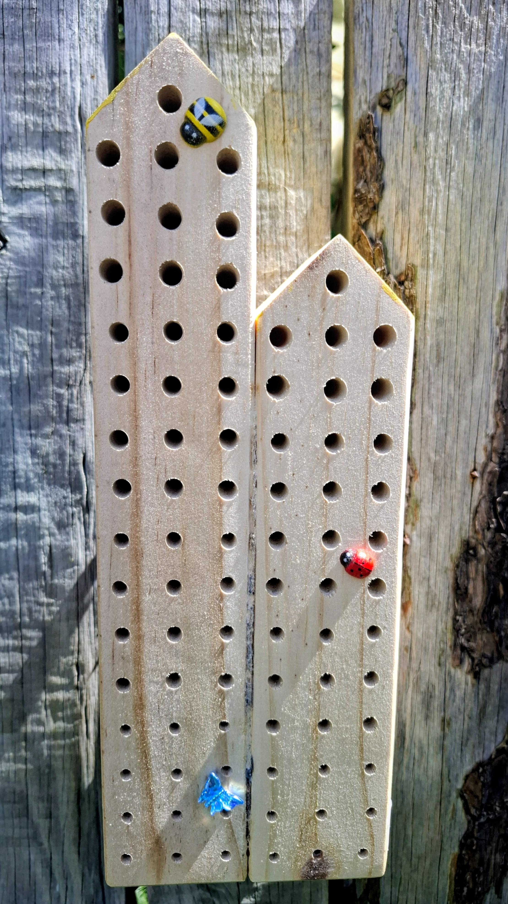
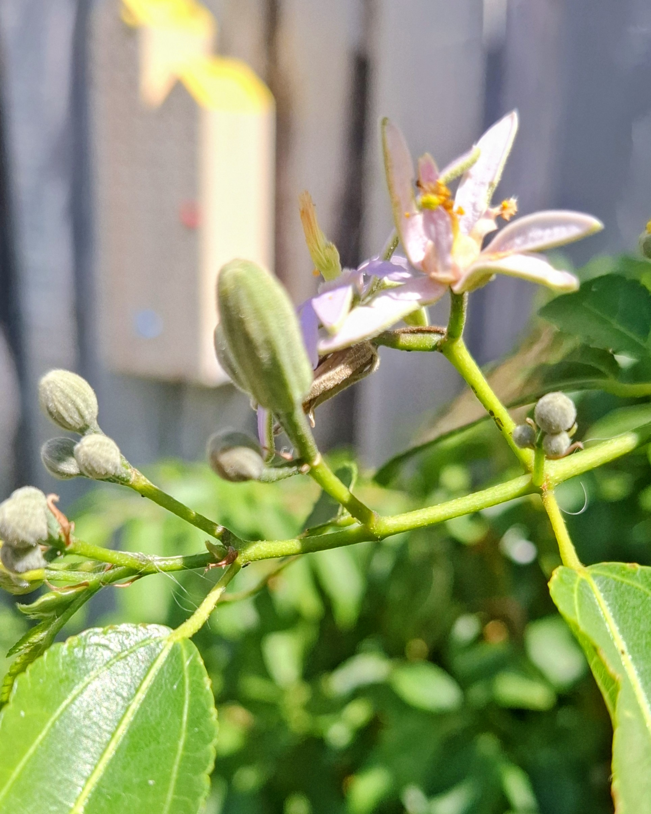

# The Bee Hotel

**A place of one's own, for bees who prefer it that way.**

{ width="100%" }

---

We've expanded.

The main hotel has always welcomed solitary bees. The Bamboo Suite and the
Drilled Log Rooms have been popular since opening day. But demand has grown, and
not every bee wants to share a building with earwigs and woodlice. Fair enough.

So we built an annexe.

---

## The New Accommodation

The Bee Hotel is a purpose-built, standalone shelter designed for one group of
guests only: **solitary bees**. It hangs on a sheltered fence in the garden,
close to flowering plants, facing the morning sun.

{ width="100%" }

The structure is made from untreated wood with rows of carefully drilled holes
in a range of widths. Each hole is a single room: smooth inside, deep enough
for a chain of nursery cells, and angled slightly to keep the rain out.

There are no shared corridors. No communal dining. No noise from the Pine Cone
Loft next door. Just a clean, quiet, south-facing row of private chambers for
bees who like things simple.

### What's on offer

- **Multiple room sizes**, from pin-thin to pencil-width, to suit different
  solitary bee species
- **Smooth, splinter-free interiors**, drilled with care into solid wood
- **South-facing position** for morning warmth and good light
- **Sheltered location**, mounted on a garden fence surrounded by herbs and
  flowering shrubs
- **Standalone building**, separate from the main hotel for a quieter stay

---

## The Neighbourhood

{ width="100%" }

The Bee Hotel sits among herbs, flowering shrubs, and garden plants that bloom
across the seasons. Foraging is close and varied. A bee checking into one of
these rooms doesn't need to fly far for pollen and nectar, and the return trip
is short.

The main hotel is nearby, and the broader garden provides water, shelter, and
a community of other pollinators. It's a good neighbourhood.

---

## Who It's For

The Bee Hotel is designed for **solitary bees** of all kinds:

- **Mason bees**, who seal their cells with mud
- **Leafcutter bees**, who line their nurseries with neat circles of leaf
- **Carpenter bees**, who appreciate a well-drilled hole
- **Any solitary bee** looking for a clean, dry, sun-warmed tunnel to call home

If you're a solitary bee and the main hotel's [Bamboo Suite or Drilled Log
Rooms](accommodation.md) feel a bit too busy, this is your place.

---

## Where It Came From

The Bee Hotel was made by **Tutus Loco**, a South African charity dedicated to
providing safe nesting sites for solitary bees. Every hotel is handmade with
care, and every purchase supports conservation work.

Tutus Loco also runs the **Jozi Bee Hotel Project** in Johannesburg, a citizen
science programme in partnership with Wits University. They've distributed
347 standardised bee hotels across the city to study urban pollination and help
communities understand the insects that quietly keep their gardens alive.

You can find them at [beehotels.co.za](https://www.beehotels.co.za/) or follow
them on social media at **@tutusloco**.

Their work is part of a growing network of insect shelters across the world.
You can see the full map on our [Network](network.md) page.

---

!!! tip "Already a guest at the main hotel?"
    The Bee Hotel is an extension of The Insect Hotel, not a replacement. All
    other room types remain open and available. Browse the full
    [accommodation options](accommodation.md) or meet [our guests](our-guests.md).

[Book Now](verify.md){ .book-button }

