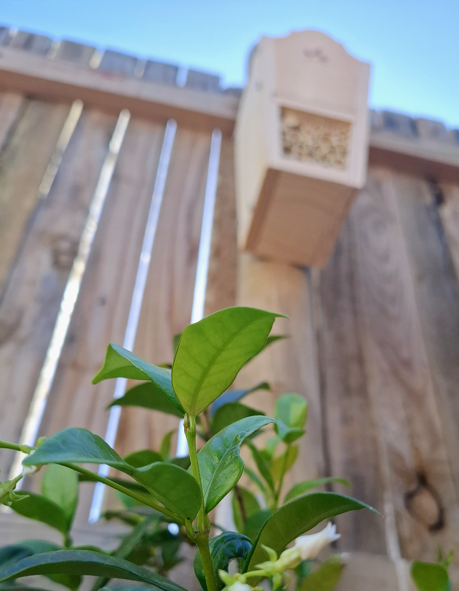
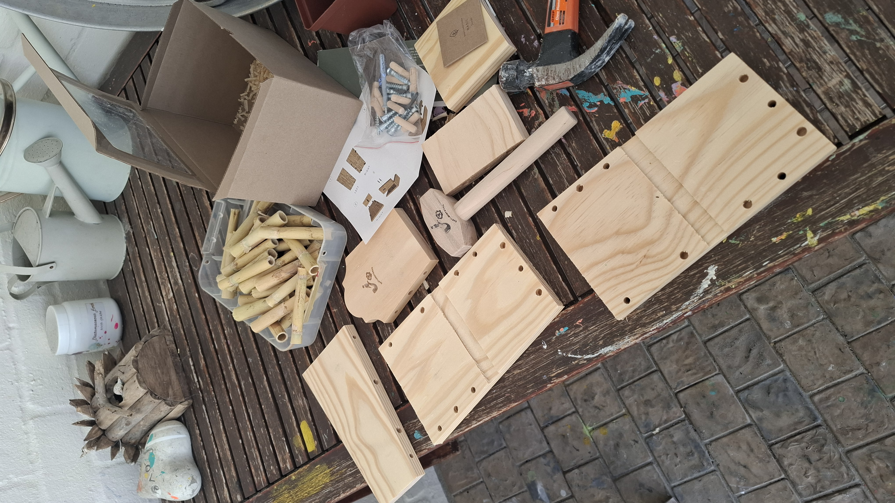
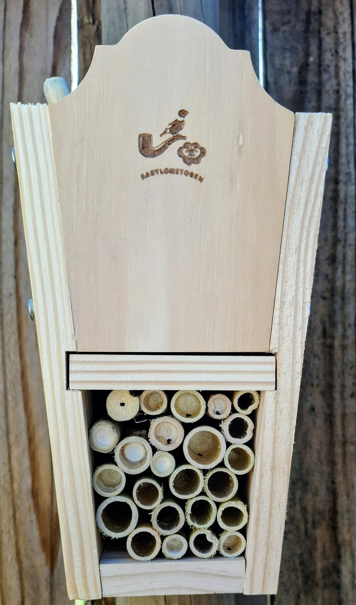

# The Bug House Kit

**Some assembly required. No experience necessary.**

{ width="100%" }

---

We've added another wing.

This time, the building work was part of the fun. The Bug House arrived as a
flat-pack kit, the kind designed for young hands and short attention spans. It
came with pre-cut wooden panels, a bag of bamboo tubes, a handful of bolts, and
a small instruction sheet. Fifteen minutes later, there was a new building on
the fence.

The clever part? A small bag of basil seeds tucked inside the box. Basil is
aromatic, and certain insects are drawn to the scent. Plant the seeds nearby,
and the Bug House doesn't just offer shelter; it advertises.

---

## What Arrived in the Box

{ width="100%" }

Everything needed for the build was in the box:

- **Pre-cut wooden panels**, drilled and ready to bolt together
- **Bamboo tubes** of varying widths, for packing into the frame
- **Bolts and fittings**, no glue or nails required
- **An instruction sheet**, clear enough for a child to follow
- **A bag of basil seeds**, to plant nearby and draw guests in

The kit is robust. The joints are solid, the wood is untreated, and the bamboo
tubes fit snugly. It's designed to survive weather, which is what outdoor
accommodation needs to do.

---

## The Finished Product

{ width="100%" }

Once assembled, the Bug House is a compact vertical shelter filled with bamboo
tubes of different diameters. Each tube is a private room: hollow, smooth, and
deep enough for a solitary bee or small wasp to lay eggs and seal them in for
the season.

The structure hangs on the garden fence alongside the Bee Hotel. Between them,
there's now a proper row of accommodation for solitary insects, each building
offering something slightly different.

### What's on offer

- **Bamboo tube rooms** in a range of widths, from narrow to pencil-sized
- **Untreated wood frame**, safe for nesting insects and built to last
- **Compact vertical design**, easy to mount on a fence or wall
- **Basil companion planting**, to attract guests with scent
- **Tool-free assembly**, bolted together in about fifteen minutes

---

## Who It's For

The Bug House is open to the same guests who'd check into the main hotel's
Bamboo Suite or the Bee Hotel's drilled-wood rooms:

- **Solitary bees**, especially mason bees and leafcutter bees looking for
  tube-style nesting sites
- **Solitary wasps**, who appreciate a clean, dry tunnel
- **Any small insect** that prefers a hollow tube to an open crevice

It's a neighbourhood that's growing. Between the main hotel, the
[Bee Hotel](bee-hotel.md), and now the Bug House, there's something for
everyone.

---

## The Build

This is a kit designed for kids, and it works. The panels bolt together without
fuss, the bamboo tubes pack tightly into the frame, and the whole thing is
sturdy enough to hang outside year-round. It took about fifteen minutes from
box to fence, no power tools, no frustration, and a small person could do most
of it with minimal help.

If you're thinking about adding insect accommodation to your own garden, a kit
like this is a good way to start. It teaches the basics: what insects need,
where to place it, why the materials matter. And at the end, you have something
real hanging on the fence.

---

!!! tip "Part of a growing estate"
    The Bug House joins the [Bee Hotel](bee-hotel.md) as one of our newest
    additions. The main hotel remains fully open with all its original room
    types. Browse the full [accommodation options](accommodation.md) or meet
    [our guests](our-guests.md).

[Book Now](verify.md){ .book-button }

