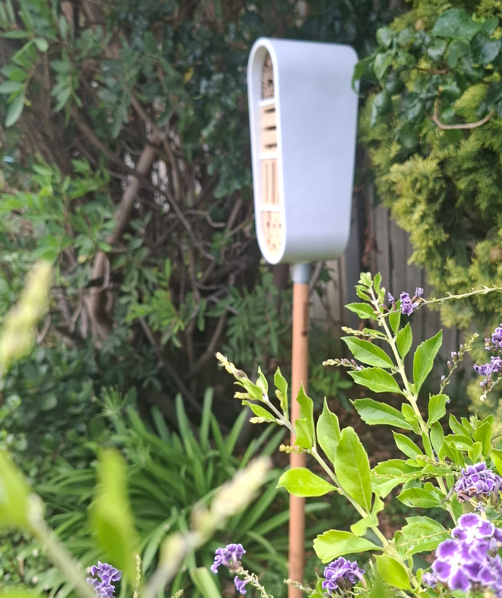

# Caring for Your Insect Hotel

**A working hotel needs a working manager. Here's how to do the job well.**

{ width="100%" }

---

You built it. They came. Now what?

An insect hotel isn't a set-and-forget garden ornament. It's a living shelter
with real residents, and like any good property, it needs a bit of upkeep. Not
much. But enough to keep things clean, safe, and welcoming.

Here's what to do, and what not to do.

---

## :material-check-circle: The Do's

### Do clean it once a year

Late winter is the time. Most guests have either emerged or are deep in
dormancy elsewhere. Open it up, remove old nesting material, brush out debris,
and check for mould or damp. This is the single most important thing you can do
for your hotel. Disease and parasites build up in old material, and a clean
hotel is a healthy hotel.

### Do replace worn materials

Bamboo splits. Wood cracks. Straw compacts. Pine cones lose their shape. If
nesting tubes are blackened, blocked, or falling apart, swap them out. Fresh
materials mean fresh bookings.

### Do keep it sheltered but sunny

Face your hotel **north to north-east** in the Southern Hemisphere (south to
south-east in the Northern Hemisphere). Morning sun warms guests early. A bit
of overhead shelter, a roof overhang, a tree canopy, keeps the worst rain off
without blocking light.

### Do plant native flowers nearby

Your guests need food within flying distance. Native wildflowers, herbs, and
flowering shrubs are best. They've evolved together with local insects and
offer the right pollen, nectar, and even the UV nectar guides that
[bees can see](not-an-insect.md) but you can't. A hotel without a garden is
just a wooden box.

### Do sand rough edges

Splintered entrances damage delicate wings. After drilling holes or cutting
bamboo, sand the openings smooth. Your guests don't complain on review sites
(well, [some do](reviews.md)), but they will simply choose a different hotel.

### Do angle tubes slightly upward

A gentle upward tilt, just a few degrees, stops rainwater from pooling inside
nesting tubes. Damp tubes grow mould. Mould kills larvae. Gravity is a free
drainage system. Use it.

### Do leave the surroundings a bit wild

Resist the urge to tidy everything. A patch of bare soil gives ground-nesting
bees a place to dig. A pile of leaf litter shelters beetles and woodlice. Long
grass hides overwintering lacewings. The mess is the point.

### Do observe from a respectful distance

Watch. Learn the species. Notice who arrives in spring and who stays through
winter. But keep your hands off during nesting season. A curious finger in a
nesting tube can destroy weeks of work.

---

## :material-close-circle: The Don'ts

### Don't disturb it during nesting season

Spring and summer are busy. Bees are laying eggs, sealing tubes, and stocking
cells with pollen. Wasps are hunting prey and packing it into chambers for
their larvae. **Do not move, open, or clean the hotel while it's occupied.**
Wait for late winter when the work is done.

### Don't use treated or painted wood

Pressure-treated timber, varnish, creosote, and paint all release chemicals
that repel or harm insects. Use **untreated, natural hardwood** only. Softwoods
like pine can work for the frame, but nesting blocks should be hardwood to
prevent splintering inside the holes.

### Don't seal the back of nesting tubes

Bamboo and reed tubes need a closed back end so there's a wall for the first
egg cell. But **never seal both ends**. Tubes must be open at the front for
entry and closed at the back naturally (at a node) or with a solid backing
board. Sealed fronts trap moisture and kill larvae.

### Don't use plastic or metal tubes

They look tidy. They last forever. And they're terrible. Plastic and metal
don't breathe. Condensation forms inside, creating the damp conditions that
breed mould and fungus. Stick to natural materials: bamboo, reed, drilled
wood, bark, straw.

### Don't place it on the ground

Ground-level hotels are buffets for slugs, ants, and damp. Raise your hotel at
least **one metre off the ground**, fixed to a wall, fence, or post. This
keeps it dry, visible to flying guests, and out of reach of the ground crew.

### Don't over-pack it

It's tempting to stuff every gap. But research shows that very large,
tightly packed hotels raise the risk of disease and parasites. In nature,
solitary bees nest in small, well-spaced groups. Leave some breathing room.
A modest hotel with good materials works better than a cramped megastructure.

### Don't use pesticides anywhere near it

This should be obvious, but it needs saying. Pesticides, including
"bee-friendly" ones (read the label twice), kill the guests you're trying to
attract. If you're building an insect hotel and spraying the garden, you're
running a shelter and a slaughterhouse on the same property.

### Don't move it once it's occupied

A sealed nesting tube means someone has laid eggs inside. Moving the hotel to
a "better" spot mid-season can disorient returning adults and expose developing
larvae to new conditions they weren't prepared for. Choose your spot carefully
at the start. Commit to it.

### Don't expect instant results

Some hotels fill up in weeks. Others take a season or two. Insects are
cautious tenants. They check the neighbourhood, the sun exposure, the food
supply, and the competition before signing a lease. If nobody shows up in the
first spring, be patient. Check your placement, plant more flowers, and wait.
They're watching.

---

## :material-calendar-clock: Seasonal Care Calendar

| Season | What to do |
|--------|-----------|
| **Late winter** | Annual clean-out. Remove old material, check for damage, replace worn tubes and fillings. |
| **Early spring** | Stand back. Watch for the first arrivals. Resist all urges to tinker. |
| **Spring – summer** | Hands off. Observe only. This is peak nesting season. |
| **Autumn** | Light check. Make sure the structure is stable before winter storms. Don't remove sealed tubes, they contain next year's guests. |
| **Winter** | Leave it alone. Some species are overwintering inside. The hotel is doing its job even when it looks empty. |

---

!!! tip "Already have a hotel?"
    Check our [Accommodation](accommodation.md) page for ideas on room types
    and materials, or browse [The Story](background.md) for building tips.

!!! quote "The golden rule"
    *"The best thing you can do for your insect hotel is mostly nothing. Clean
    it once a year, plant flowers around it, and let the guests get on with
    their lives."*

[Book Now](verify.md){ .book-button }

