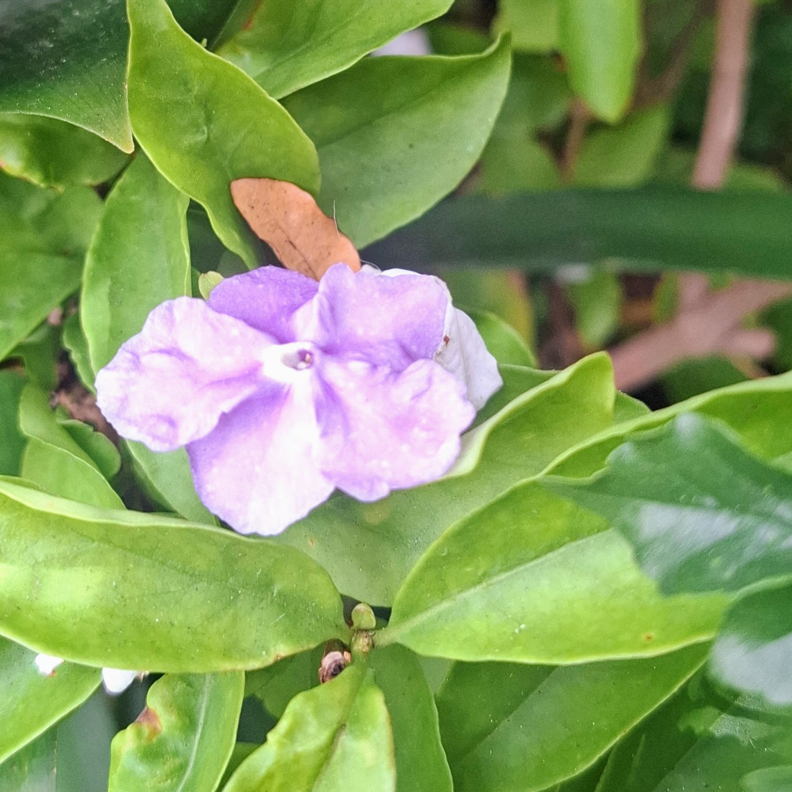
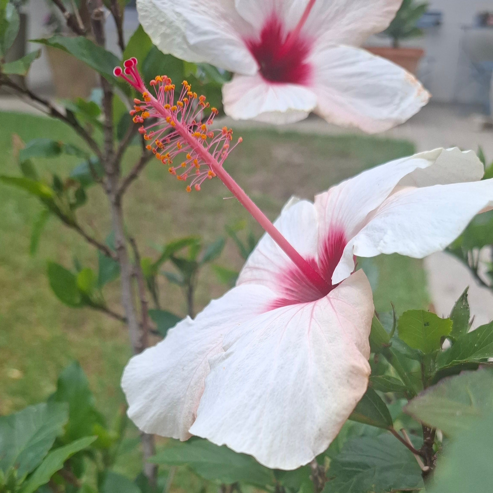

# Local Area & Activities

The Insect Hotel isn't just a place to stay. It's a gateway to one of the most
biodiverse regions on the planet. Step outside your chamber and the Western Cape
unfolds before you.

---

## The Landscape

### Fynbos

The main plant life around the hotel is **fynbos**, a UNESCO-recognised plant
kingdom found only in the Western Cape. Heathers, proteas, restios, and ericas
create a year-round patchwork of feeding chances. If you're a pollinator, this
is paradise.

.jpg){ width="100%" }

### Mountains

The mountains rise just behind the hotel. They offer strong thermal currents for
daring flyers and sheltered valleys for those who prefer calmer air. Rocky
outcrops provide extra basking spots on cool mornings.

### The Sea

The coastline is a short flight away. Most of our guests prefer to stay inland,
but the sea breeze brings moisture and keeps temperatures mild. Coastal
wildflowers extend the feeding range for keen day-trippers.

.jpg){ width="100%" }

### Forest Pockets

Scattered patches of native forest provide shade, humidity, and a completely
different ecosystem to explore. Ideal for guests who enjoy variety.

.jpg){ width="100%" }

---

## What's on the Menu

The garden and surrounding landscape provide an ever-changing buffet. Here's a
taste of what's in bloom:

{ width="100%" }

{ width="100%" }

{ width="100%" }

And in the surrounding fynbos:

.jpg){ width="100%" }

.jpg){ width="100%" }

.jpg){ width="100%" }

---

## Seasonal Activities

### Spring (September – November)

- **Peak bloom season.** Fynbos erupts in colour. Foraging at its finest.
- Nesting season for solitary bees, and prime time to claim a room.
- Warm days, cool nights. Occasional rain.

### Summer (December – February)

- **Dry and hot.** Minimal rain, long days, maximum flight time.
- Wildflowers in full display.
- Shade trees become popular gathering spots.
- Fire risk season. The fynbos is adapted to it; so should you be.

### Autumn (March – May)

- Temperatures ease. Early rains begin.
- Late-season foraging on autumn-flowering species.
- A quieter time at the hotel, ideal for guests seeking peace.

### Winter (June – August)

- **Rainy season.** Expect wet days and blustery winds.
- Wintering guests hunker down in insulated rooms.
- The landscape rests and rebuilds.
- Fewer guests, more space. Perfect for the thoughtful insect.

---

## Local Community

The neighbours are, on the whole, welcoming:

- **Birds**: mostly keep to themselves, though some will try their luck. Stay
  alert, stay small, stay in your room if unsure.
- **Lizards**: sunbathe nearby but are usually more interested in warming up
  than hunting.
- **Spiders**: some share the hotel. A respectful distance is advised.
- **Plants**: the true hosts of this landscape. They feed you, shelter you, and
  ask nothing in return but the occasional pollination.
- **Humans**: the ones who built the hotel. They watch from a distance, top up
  the water now and then, and find the whole setup delightful.

---

## Getting Here

The Insect Hotel is reached by air only. Navigate by:

- **Scent**: follow the smell of blooming fynbos
- **Sight**: look for the wooden structure facing south-east, near the garden
  edge
- **Instinct**: you'll know it when you see it

---

!!! note "Travel advisory"
    Wind conditions can be tough, especially in winter and during south-easterly
    gales in summer. Plan your approach with care. We suggest arriving on calm
    mornings for the smoothest landing.

[Book Now](verify.md){ .book-button }

