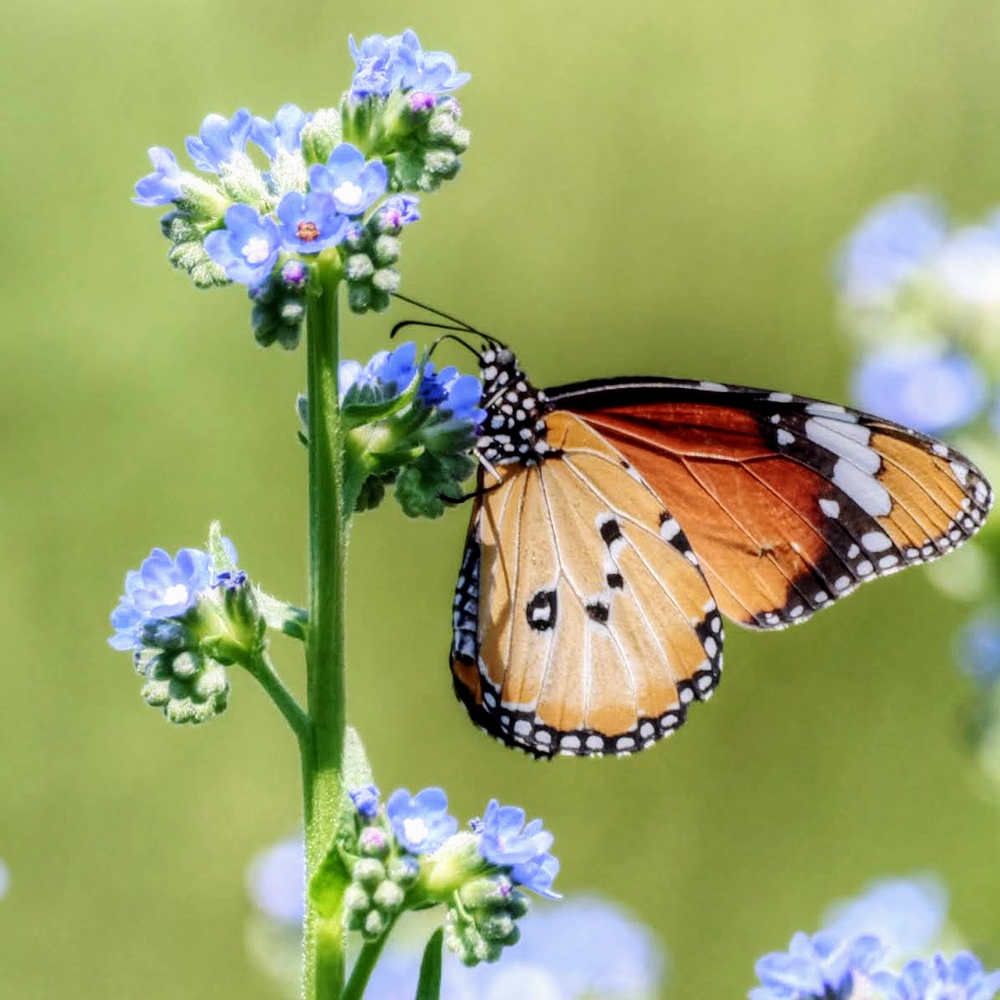

# You Are Not an Insect.

We regret to inform you that your verification has failed. You selected
ultraviolet blocks with all the confidence of someone who **cannot see
ultraviolet light** — which is to say, a human.

An actual insect would have found this trivially easy. You, however, were
staring at a grid of nearly identical pale lavender squares and hoping for the
best.

**Your booking has not been confirmed.**

---

!!! quote ""
    *"Butterflies may have a slightly lower visual acuity than ourselves, but in
    many respects they enjoy a clear advantage over us: they have a very large
    visual field, a superior ability to pursue fast-moving objects and can even
    distinguish ultraviolet and polarized light."*

    — Kentaro Arikawa, Professor of Biology, Sokendai

---

## What Insects See That You Cannot

You just failed a test that most of The Insect Hotel's guests would pass
without thinking. But what exactly do they see that you don't? The answer
depends on the guest.

Different insects have radically different visual systems. Some see three
colours. Some see fifteen. Some see polarised light, structural iridescence on
petals, or UV nectar guides painted across flowers like runway markings. The
world they inhabit is richer, stranger, and more colourful than anything a
human eye can access.

Here's what the science tells us.

---

## The Honeybee: Where It All Started

In 1914, a young Austrian researcher named **Karl von Frisch** trained honeybees
to collect sugar water from a blue card placed among grey cards of varying
brightness. If bees were colour-blind — as the prominent physiologist Carl von
Hess had claimed in 1912 — they would confuse the blue card with a grey card of
similar brightness. They didn't. They chose blue every time.

Von Frisch had demonstrated true colour vision in a non-human animal (the
second researcher to do so, after Charles Henry Turner). He went on to win the
**Nobel Prize in Physiology or Medicine in 1973**, shared with Konrad Lorenz and
Nikolaas Tinbergen, for his lifetime of work on bee sensory perception and
communication, including the discovery of the waggle dance.

But bee colour vision is not like ours. Where humans have three types of colour
receptor (red, green, blue — peaking at roughly 560, 530, and 420 nm),
honeybees also have three — but shifted toward shorter wavelengths:

| Receptor | Peak sensitivity | Colour |
|----------|-----------------|--------|
| S (short) | 344 nm | Ultraviolet |
| M (medium) | 436 nm | Blue |
| L (long) | 544 nm | Green |

*Source: Peitsch et al., 1992; confirmed by intracellular recordings, Menzel &
Blakers, 1976.*

This means bees can see ultraviolet light but **cannot see red**. A red poppy
appears dark and colourless to a bee. But a white clover flower — plain to us —
blazes with UV patterns that guide the bee directly to the nectar.

**Randolf Menzel** at Freie Universität Berlin spent decades building on von
Frisch's work, confirming trichromacy through electrophysiology (Menzel, 1975;
Menzel & Blakers, 1976) and mapping the neural colour-processing pathways in
the bee brain. His lab showed that bee colour vision shares fundamental
properties with human colour perception — colour constancy, colour opponency,
and separate processing of colour and brightness — but operates in a completely
different spectral range.

*Key source: Hempel de Ibarra, Vorobyev & Menzel (2014), "Mechanisms, functions
and ecology of colour vision in the honeybee", Journal of Comparative
Physiology A.*

---

## Solitary Bees: The Hotel's Core Guests

The Insect Hotel is built for solitary bees — leafcutter bees (*Megachile*),
carpenter bees (*Xylocopa*), and other cavity-nesters — not honeybees. So what
do *they* see?

The most detailed study of solitary bee vision comes from **Menzel, Steinmann,
de Souza & Backhaus (1988)**, who measured the photoreceptors of the European
*Osmia rufa* (now *Osmia bicornis*) using a fast voltage-clamp technique. While
*Osmia* doesn't occur in southern Africa, the findings apply broadly across
solitary bees. They found three receptor types:

| Receptor | Peak sensitivity |
|----------|-----------------|
| UV | 348 nm |
| Blue | 436 nm |
| Green | **572 nm** |

That green receptor is significant. At 572 nm, it is shifted **28 nm toward
longer wavelengths** compared to the honeybee's green receptor (544 nm). This
means solitary bees are slightly more sensitive toward the yellow-orange end of
the spectrum — potentially an adaptation to the specific flowers they visit.

Behavioural tests showed that *Osmia rufa* discriminates colours **at least as
well as the honeybee**, and possibly better. In colour-choice experiments,
solitary bees matched honeybee performance precisely, while stingless bees
(*Melipona quadrifasciata*, a Neotropical species) performed worse in the
violet-blue region.

*Source: Menzel et al. (1988), "Spectral sensitivity of photoreceptors and
colour vision in the solitary bee, Osmia rufa", Journal of Experimental
Biology.*

Research on leafcutter bees (*Megachile rotundata*, a Eurasian species widely
studied for its navigational abilities) has focused more on visual navigation —
they learn the positions of edges and landmarks relative to their nest
entrance — but their photoreceptor architecture is believed to follow the same
trichromatic (UV, blue, green) plan shared across Hymenoptera. The Western
Cape's native *Megachile* species almost certainly share this visual system.

**What this means for The Insect Hotel:** When a solitary bee approaches the
hotel, it sees the surrounding flowers in UV, blue, and green — a completely
different palette from yours. The bamboo tubes and drilled wood, which appear
uniformly brown to you, likely present a more complex pattern of UV-reflective
and UV-absorbing surfaces. The bee navigates by learning the visual landmarks
around its chosen chamber — the edges, the contrasts, the spatial arrangement —
and can find its nest entrance with remarkable precision.

---

## Butterflies: Fifteen Shades of Photoreceptor

{ width="100%" }

If bees are trichromatic, butterflies are something else entirely.

In 2016, **Kentaro Arikawa** and colleagues at Sokendai (the Graduate University
for Advanced Studies, Japan) published a landmark finding: the Common Bluebottle
butterfly (*Graphium sarpedon*) has **15 distinct classes of photoreceptor** —
the most ever found in any insect. The classes span from ultraviolet through
violet, blue, blue-green, green, orange, to multiple shades of red.

Previously, no insect was known to have more than nine.

*"We have studied color vision in many insects for many years, and we knew that
the number of photoreceptors varies greatly from species to species. But this
discovery of 15 classes in one eye was really stunning."* — Kentaro Arikawa

But the butterflies don't use all fifteen for routine colour vision. Arikawa's
team showed that *Graphium sarpedon* likely uses **four** receptors for
general colour perception and deploys the other eleven for specialised tasks:
detecting fast-moving objects against the sky, spotting colourful objects hidden
in vegetation, or recognising mates.

The earlier work on the Asian Swallowtail (*Papilio xuthus*) showed that its
six photoreceptors support **tetrachromatic** vision — four-channel colour
processing (UV, blue, green, red) — enabling wavelength discrimination as fine
as **1–2 nanometres** in certain spectral regions. That rivals human
performance.

*Source: Chen, Awata, Matsushita, Yang & Arikawa (2016), Frontiers in Ecology
and Evolution. Also: Arikawa (2017), "The eyes and vision of butterflies",
Journal of Physiology.*

**What this means for The Insect Hotel:** A butterfly passing through the garden
sees the hibiscus and Brunfelsia flowers in a richer palette than you can
imagine — not just the pinks and purples visible to you, but additional channels
of UV patterning and fine spectral distinctions that create a different flower
entirely. The "white" hibiscus in the garden likely carries UV markings that
make it a vivid, high-contrast target.

---

## Hoverflies: Yellow Means Food

Hoverflies (Syrphidae) are another common visitor to insect hotels — and their
visual system differs again. Flies have **four spectral classes of
photoreceptor**, arranged in a fundamentally different architecture from bees.

Electrophysiological work on *Eristalis tenax* (the dronefly, a common
hoverfly) identified photoreceptors peaking at **330 nm, 340 nm, 460 nm, and
540 nm** (Horridge et al., 1975). Their colour processing follows the **Troje
model** (Troje, 1993), which divides fly colour space into four categorical
regions: UV, Blue, Green, and a theoretical Purple.

But hoverflies have a striking behavioural quirk: they possess an **innate,
unshakeable preference for yellow**. Naïve *Eristalis* that have never seen a
flower will extend their proboscis toward yellow stimuli and land on yellow
surfaces. This preference cannot be overridden by training — even flies raised
on blue-coloured nutrient sources still prefer yellow.

Recent research by Hannah et al. (2019, *Current Zoology*) showed that despite
the categorical structure of fly colour processing, hoverflies actually
discriminate colours along a **continuous function** — more like bees than
previously thought.

**What this means for The Insect Hotel:** When a hoverfly arrives, it is drawn
first to yellow flowers in the garden. The Brunfelsia's purple blooms may be
less attractive; the yellow centres of other flowers will pull it in. It sees
the insect hotel's wooden surfaces differently from a bee — the four-channel
system creates a different visual interpretation of the same bamboo and bark.

---

## Lacewings: Eyes Built for Darkness

Green lacewings are largely **nocturnal**, and their eyes reflect this. Unlike
the apposition compound eyes of bees, lacewings have **refractive superposition
eyes** — large, golden-iridescent hemispheres that gather far more light per
receptor, enabling vision in near-darkness. (The Western Cape species is
*Chrysoperla zastrowi*, part of the *carnea* species complex — the vision
research below was conducted on the European *C. carnea*, but the eye
architecture is shared across the group.)

**Kral & Stelzl (1998)** showed that the absolute sensitivity of *Chrysoperla
carnea*'s compound eyes changes dramatically through the day: **highest at
midnight, lowest at noon**. The sensitivity shift is most pronounced in the
blue-green to green region of the spectrum. The eye achieves this by physically
adjusting its superposition aperture — widening it at night to admit more light.

Photoreceptor studies in related neuropterans (owlflies, *Ascalaphus*) found
peak sensitivity in the **green** (520 nm) for the large receptor cells and in
the **UV** (343 nm) for the smaller R7/R8 cells. *Chrysoperla*'s compound eyes
are similarly sensitive.

*Source: Kral & Stelzl (1998), "Daily visual sensitivity pattern in the green
lacewing Chrysoperla carnea", European Journal of Entomology.*

**What this means for The Insect Hotel:** A lacewing arriving at dusk sees the
hotel in a way no daytime visitor does. Its superposition eyes pull in the
fading light, rendering the structure visible long after it would disappear from
human sight. It detects the UV signatures of surrounding vegetation and
navigates to the bark crevices and straw bundles where it shelters — all in
conditions you'd call darkness.

---

## Dragonflies: The Apex of Insect Vision

Dragonflies don't typically check into insect hotels, but they may patrol the
garden — and their eyes are in a class of their own.

Each dragonfly compound eye contains up to **30,000 ommatidia** (compared to
roughly 5,000 in a honeybee). More remarkably, recent genomic work has revealed
that dragonflies possess between **15 and 33 opsin genes** — far more than any
other insect group and rivalling mantis shrimps (Futahashi et al., 2015).

Over **80% of a dragonfly's brain** is devoted to visual processing. Their
compound eyes are functionally divided: the **dorsal (upward-facing) region**
contains UV and blue receptors optimised for spotting prey silhouetted against
the sky, while the **ventral (downward-facing) region** contains longer-
wavelength receptors (green, orange) suited to perceiving terrestrial objects.
As dragonfly vision researcher Robert Olberg explained: *"They are segregated in
the compound eye so that the upwards facing eye has only blue and UV receptors,
and the downwards facing eye has receptors for longer wavelengths."*

They also detect **polarised light** using specialised photoreceptors in the
dorsal rim area (DRA) of their eyes — crucial for detecting water surfaces and
navigating by skylight.

---

## The Hidden Signals: UV Nectar Guides and Structural Colour

Insects don't just see differently — the flowers have evolved to exploit it.

### Nectar guides

Many flowers carry **UV-absorbing patterns** — called nectar guides — that are
invisible to the human eye but form bold, high-contrast landing targets for
pollinators. A sunflower that appears uniformly yellow to you is, under UV
photography, a dramatic two-toned bullseye: UV-absorbing petals at the tips
surrounding a bright UV-reflecting centre. The whole flower is a signal, and the
signal isn't meant for you.

These patterns have been documented across hundreds of species, from daisies and
buttercups to evening primroses and marsh marigolds.

### The blue halo

In 2017, **Moyroud, Wenzel, Middleton** and colleagues at Cambridge published a
remarkable finding in *Nature*: many flowers produce a **"blue halo"** caused by
disordered nanostructures on their petal surfaces. These nano-ridges are
slightly irregular — imperfect in ways that are consistent across unrelated
flower lineages — and they scatter light predominantly at **short wavelengths
(UV and blue)**.

The researchers manufactured artificial flowers with tailored levels of
structural disorder and tested foraging bumblebees. The bees could detect and
learn to use the blue halo, even when the underlying pigment colour was
identical. The nanostructures had evolved, independently and repeatedly, to
produce an optical signal that is **specifically salient to insect pollinators**.

*Source: Moyroud et al. (2017), "Disorder in convergent floral nanostructures
enhances signalling to bees", Nature 550: 469–474.*

---

## Polarised Light: The Invisible Compass

Many insects can detect the **polarisation** of light — a property completely
invisible to the human eye. Polarised light patterns in the sky, created by
sunlight scattering in the atmosphere, form a compass that persists even on
overcast days.

**Desert ants** (*Cataglyphis*) are the textbook example, using polarised
skylight to navigate vast, featureless desert landscapes. But bees use it too —
Karl von Frisch himself demonstrated that honeybees orient their waggle dances
using polarised light patterns.

**Dragonflies** use polarisation sensitivity to detect water surfaces (which
strongly polarise reflected light) and for navigation via the dorsal rim area
of their compound eyes.

---

## What The Insect Hotel Looks Like to Its Guests

When you look at The Insect Hotel, you see a charming wooden structure with
bamboo tubes, slatted wood, and drilled holes. Brown and cream. Simple.

An insect sees something else entirely:

**A solitary bee** (*Megachile*) approaching the hotel sees the bamboo tubes as a
mosaic of UV-reflective and UV-absorbing surfaces. The surrounding flowers are
not just purple and white — they carry bold UV nectar guides and iridescent
blue halos on their petals. The bee has memorised the precise arrangement of
visual edges around its chosen chamber and navigates back to it with sub-
centimetre accuracy.

**A lacewing** (*Chrysoperla*) arriving at dusk sees the hotel's silhouette
rendered visible by superposition optics long after human vision would fail. The
green-and-UV sensitivity of its receptors picks out the bark textures and straw
bundles where it will shelter. By midnight, its eyes are at peak sensitivity,
and the garden is far from dark.

**A hoverfly** (*Eristalis*) scans the garden through four-channel colour
vision, locks onto the yellow stimuli it is innately programmed to approach,
then uses motion-sensitive neurons to hover with precision near the flower
heads. The insect hotel's wooden surfaces register in its fly-specific colour
space — a different perceptual experience from the bee's.

**A visiting butterfly** perceives the garden through up to fifteen types of
photoreceptor, seeing fine spectral distinctions in flower petals that neither
you nor the bee can detect. The hibiscus blossom is not just white-and-pink: in
the butterfly's expanded visual range, it may be a completely different colour.

All of them can see the ultraviolet blocks you just failed to identify.

---

## Why This Matters

Understanding insect vision has real consequences:

- **Conservation.** If we design pollinator gardens based on human aesthetics
  alone, we may plant flowers that look appealing to us but present poor signals
  to the bees and hoverflies we're trying to attract. UV-reflective species and
  those with strong nectar guides are far more effective.
- **Agriculture.** Pesticide residues can alter the UV-reflectance properties of
  treated flowers, potentially disrupting the visual signals that guide
  pollinators to crops (Moyroud et al., 2017).
- **Lighting.** Artificial light at night — especially UV-emitting lights — is
  devastating to nocturnal insects like lacewings. Shifting to longer-wavelength,
  insect-friendly lighting requires understanding what insects actually see.
- **Appreciation.** The natural world contains information, beauty, and
  communication that is entirely invisible to human perception. The garden
  around The Insect Hotel is full of signals you will never see — and every one
  of them is there for a reason.

---

## So, What Now?

You're not an insect. You can't check in to The Insect Hotel. But you can do
something arguably better:

**Build one.**

An insect hotel in your garden provides critical habitat for solitary bees,
lacewings, ladybirds, and other beneficial insects. Use bamboo tubes, drilled
logs, pine cones, bark, and bundles of hollow stems. Face it north-east. Place
it near flowering plants — especially those with strong UV nectar guides. And
then step back and let the real guests arrive.

They'll see things you never will. And they'll appreciate it more than you know.

---

### Sources and Further Reading

- Von Frisch, K. (1914). Demonstration of colour perception in bees. *Zoologische Jahrbücher*
- Menzel, R. & Blakers, M. (1976). Colour receptors in the bee eye — morphology and spectral sensitivity. *Journal of Comparative Physiology A*
- Menzel, R., Steinmann, E., de Souza, J. & Backhaus, W. (1988). Spectral sensitivity of photoreceptors and colour vision in the solitary bee, *Osmia rufa*. *Journal of Experimental Biology*
- Hempel de Ibarra, N., Vorobyev, M. & Menzel, R. (2014). Mechanisms, functions and ecology of colour vision in the honeybee. *Journal of Comparative Physiology A*
- Chen, P-J., Awata, H., Matsushita, A., Yang, E-C. & Arikawa, K. (2016). Extreme spectral richness in the eye of the Common Bluebottle butterfly, *Graphium sarpedon*. *Frontiers in Ecology and Evolution*
- Arikawa, K. (2017). The eyes and vision of butterflies. *Journal of Physiology* 595(16): 5457–5468
- Kral, K. & Stelzl, M. (1998). Daily visual sensitivity pattern in the green lacewing *Chrysoperla carnea*. *European Journal of Entomology*
- Troje, N. (1993). Spectral categories in the learning behaviour of blowflies. *Zeitschrift für Naturforschung*
- Hannah, L. et al. (2019). Psychophysics of the hoverfly: categorical or continuous colour discrimination? *Current Zoology* 65(4): 483–492
- Moyroud, E. et al. (2017). Disorder in convergent floral nanostructures enhances signalling to bees. *Nature* 550: 469–474
- Futahashi, R. et al. (2015). Extraordinary diversity of visual opsin genes in dragonflies. *Proceedings of the National Academy of Sciences*
- Peitsch, D. et al. (1992). The spectral input systems of hymenopteran insects and their receptor-based colour vision. *Journal of Comparative Physiology A*

---

  <a href="../" class="md-button md-button--primary">Back to The Insect Hotel</a>

