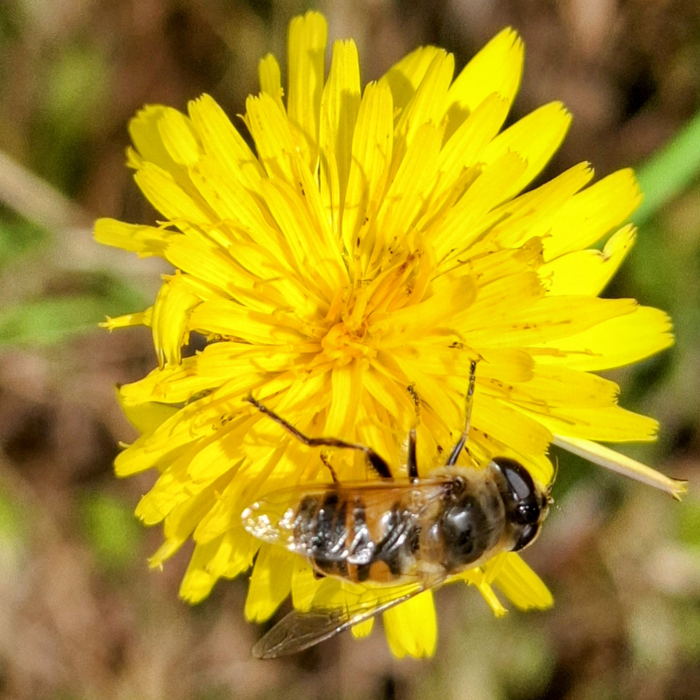
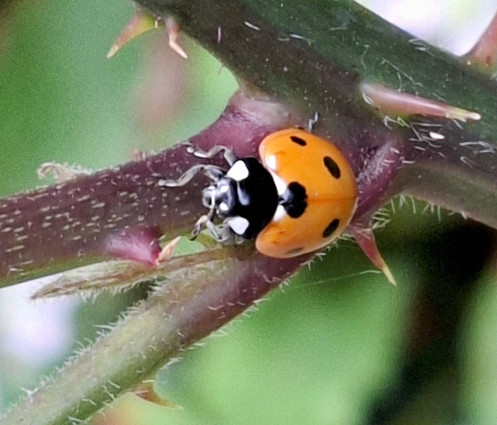
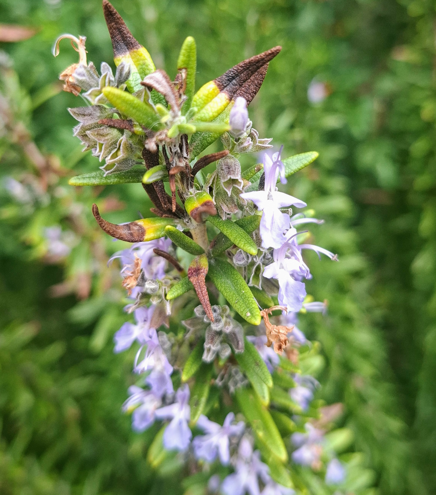
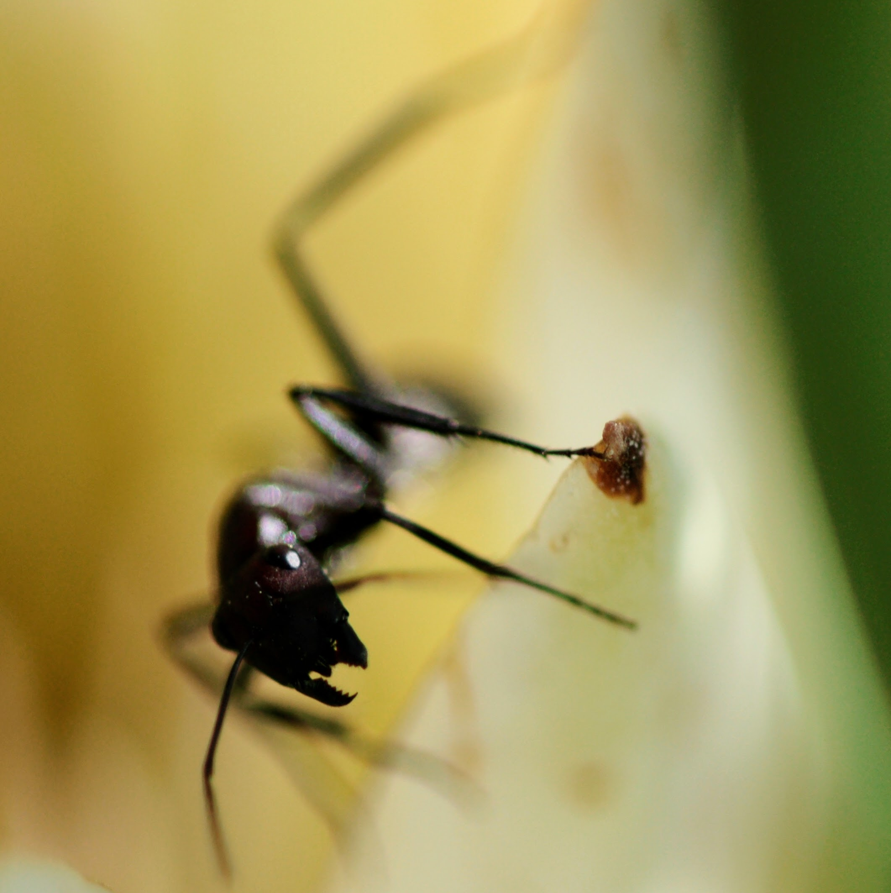
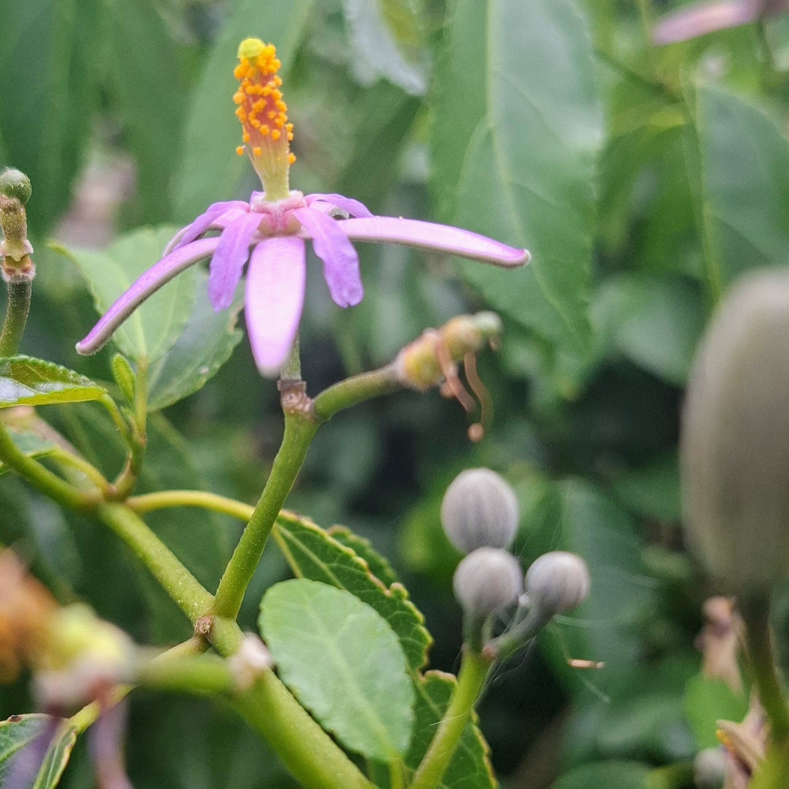

# Our Guests

The Insect Hotel doesn't advertise. It doesn't need to. The guests who find
their way here are drawn by instinct, scent, and the quiet promise of shelter
in a world that offers them very little of it.

Each of our guests has a reason for being here — and each plays a role in the
garden ecosystem that most humans never notice. Here's who you might find
checking in, and why this place matters to them.

{ width="100%" }

---

## :material-bee: Solitary Bees

{ width="100%" }

**The hotel's most important guests.**

Leafcutter bees (*Megachile*), carpenter bees (*Xylocopa*), and other
cavity-nesting solitary bees are not honeybees. They don't live in hives, they
don't make honey, and they don't have a queen. Each female is an independent
operator — she mates, finds a suitable cavity, and provisions it with pollen and
nectar for her offspring. Then she seals the entrance and moves on. No colony.
No caste system. Just quiet, solitary work.

### Why they need the hotel

Here's the problem: suitable nesting cavities are scarce. In the wild, solitary
bees nest in hollow plant stems, beetle borings in dead wood, gaps in old
masonry, and crumbling earth banks. Modern gardens, with their tidy fences,
treated timber, and paved surfaces, offer almost none of this. An insect hotel
provides exactly what a solitary bee is searching for — a dry, sheltered cavity
of the right diameter, facing the morning sun, close to flowers.

**Cavity-nesting solitary bees** prefer smooth-walled tunnels **6–10 mm** in
diameter and about **15 cm** deep. They build internal walls from mud or resin,
creating a chain of sealed cells, each containing a single egg and a pollen
loaf. They emerge in spring as the fynbos and garden flowers come into bloom,
and solitary bees can be extraordinarily efficient pollinators — making them
invaluable gardeners.

**Leafcutter bees** (*Megachile*) are slightly smaller, preferring tunnels of
**5–8 mm**. They cut precise semicircles from rose leaves and soft foliage to
line their cells — if you've ever noticed perfectly circular notches in your
rose bushes, you've had a leafcutter as a neighbour.

**Preferred rooms:** [The Bamboo Suite, The Drilled Log Rooms](accommodation.md)

---

{ width="100%" }

## :material-bug: Solitary Wasps

**The misunderstood professionals.**

Forget what you know about wasps from braais and picnics. The solitary wasps
that use insect hotels are nothing like yellowjackets or hornets. Species like
the potter wasps (*Delta*) and various solitary hunting wasps are calm, docile,
and extraordinarily useful. They rarely sting — and even if they did, their
venom is mild compared to social wasps.

### Why they need the hotel

Solitary wasps are specialist predators. Depending on the species, a single
female may provision her nest with caterpillars, aphids, beetle larvae, or
spiders — paralysed with precision and stored alive as fresh food for her
young. One wasp can remove hundreds of garden pests in a single season.

Like solitary bees, they need small cavities for nesting and are losing habitat
to the same forces — tidied gardens, sealed walls, removed deadwood. An insect
hotel with tubes in the **3–8 mm** range gives them exactly what they need.

You can tell a wasp-occupied tube from a bee-occupied one by the cap: solitary
bees typically seal with mud or leaf material, while many wasps use a
distinctive plug of dried mud, sometimes mixed with sand grains.

**Preferred rooms:** [The Bamboo Suite, The Straw Gallery](accommodation.md)

---

## :material-ladybug: Ladybirds

{ width="100%" }

**Wet-season refugees.**

A single ladybird can eat **5,000 aphids** in its lifetime. In summer, they're
dispersed across the garden, methodically clearing plants of pests. But when
autumn arrives and the Western Cape's wet winter sets in, ladybirds need a
sheltered, dry place to enter dormancy and wait out the rains until spring.

### Why they need the hotel

In the wild, ladybirds shelter in leaf litter, under bark, and in rock
crevices. They often cluster together — sometimes in groups of dozens — to
conserve moisture and avoid waterlogged conditions. An insect hotel's pine
cones, bark layers, and stacked crevices provide exactly this: a complex,
sheltered space with multiple entry points where ladybirds can tuck in for the
wet months.

Without adequate winter shelter, ladybird populations decline — and the
following spring's aphid problems multiply accordingly. The hotel doesn't just
house ladybirds; it safeguards the garden's pest control for the season ahead.

**Preferred rooms:** [The Pine Cone Loft, The Bark Hideaway](accommodation.md)

---

## :material-butterfly: Lacewings

**The night shift.**

Green lacewings (*Chrysoperla zastrowi*) are among the most effective biological
pest controllers on the planet. Their larvae — sometimes called "aphid lions" —
are voracious predators, consuming up to **200 aphids per week** along with
mites, thrips, whitefly eggs, and small caterpillars. The adults are delicate,
pale green insects with large, translucent, intricately veined wings and
golden eyes.

### Why they need the hotel

Lacewings are largely nocturnal and crepuscular. Their extraordinary
superposition eyes — those golden, iridescent hemispheres — are built for
gathering light in near-darkness. During the day, they rest. During winter, they
need a dry, sheltered site to ride out the wet season.

This is where many lacewing populations are lost. Cold, waterlogged nights in
exposed positions can kill dormant adults. An insect hotel provides sheltered
chambers — pine cones, tightly packed straw, bark crevices — where lacewings
can sit out the winter rains in relative safety. The complex, layered structure
mimics the bark fissures and dense vegetation they naturally seek.

Come spring, surviving lacewings lay hundreds of eggs on nearby plants, and the
cycle of pest control begins again.

**Preferred rooms:** [The Pine Cone Loft, The Straw Gallery](accommodation.md)

---

{ width="100%" }

## :material-bee-flower: Hoverflies

**Pollinators in disguise.**

Hoverflies (Syrphidae) are the mimics of the insect world — many species wear
wasp-like stripes despite being completely harmless. They're superb pollinators,
second only to bees in many ecosystems, and their larvae are devastating
predators of aphids.

### Why they need the hotel

Adult hoverflies need sheltered resting spots close to foraging areas. Some
species become dormant during the wet winter months and need the same kind of
sheltered crevice habitat as lacewings. Others pass the winter as pupae in soil
or leaf litter.

An insect hotel surrounded by flowering plants is ideal: the adults can forage
among the fynbos and garden flowers by day — drawn especially to yellow blooms,
which they are innately, unshakeably attracted to — and retreat to the hotel's
bark layers and straw bundles at night or during poor weather.

Their larvae, deposited on aphid-infested plants nearby, provide free, silent,
tireless pest control.

**Preferred rooms:** [The Bark Hideaway, The Straw Gallery](accommodation.md)

---

## :material-shield-bug-outline: Earwigs

**Unfairly maligned.**

The common earwig (*Forficula senegalensis*) has an image problem. Those
pincers look threatening, and the old myth about crawling into ears persists.
In reality, earwigs are **omnivorous scavengers and predators** — they eat
aphids, mites, insect eggs, and decaying plant material. They are, on balance,
beneficial to gardens.

### Why they need the hotel

Earwigs are nocturnal and need dark, tight-fitting daytime refuges. In nature,
they shelter under bark, in flower heads, and in soil crevices. They are also
remarkable parents — the female guards her eggs and tends the nymphs after
hatching, one of the very few examples of maternal care in non-social insects.

An insect hotel's pine cones, bark layers, and bundled stems provide exactly
the kind of narrow, dark spaces earwigs seek. A female sheltering in a pine
cone crevice with her clutch of eggs is not a pest — she's a mother doing her
best in a world full of predators.

**Preferred rooms:** [The Pine Cone Loft, The Bark Hideaway](accommodation.md)

---

{ width="100%" }

## :material-bug-outline: Beetles

**The quiet majority.**

Beetles are the most species-rich order of insects on Earth — and several
groups are valuable garden inhabitants. **Ground beetles** (Carabidae) are
nocturnal predators of slugs, snails, and soil-dwelling larvae. **Rove
beetles** (Staphylinidae) hunt aphids and small invertebrates. Even **bark
beetles** and **wood-boring beetles** play a role in breaking down dead plant
material and recycling nutrients.

### Why they need the hotel

Many beetles need undisturbed ground-level habitat — leaf litter, loose bark,
and decaying wood. Modern gardens often remove all of this in the pursuit of
tidiness. An insect hotel with a generous leaf litter base and stacked bark
provides the dark, damp, sheltered conditions that predatory beetles need to
thrive.

A garden with a healthy beetle population has fewer slugs, fewer soil pests,
and better nutrient cycling. The beetles ask for nothing but to be left alone
in the dark.

**Preferred rooms:** [The Bark Hideaway, The Leaf Litter Lounge](accommodation.md)

---

## :material-butterfly-outline: Butterflies

{ width="100%" }

**Passing through — or sheltering through winter.**

Most butterflies won't nest in an insect hotel, but several species become
dormant during the cooler, wetter months and need sheltered resting sites.
Pansies (*Junonia*), the African Monarch (*Danaus chrysippus*), and other local
species seek out dry crevices in autumn, entering a quiet period until the
warmer weather returns.

### Why they need the hotel

Dormant butterflies are extraordinarily vulnerable. A flooded shelter, a
prolonged damp spell, or a curious predator can be fatal. They need stable,
dry, undisturbed spaces that maintain relatively constant conditions through the
wet winter months.

An insect hotel's slatted wood panels, bark layers, and leaf litter sections
offer exactly this — narrow vertical gaps and sheltered recesses where a
dormant butterfly can rest with folded wings, camouflaged against the wood,
undisturbed until spring.

The **Table Mountain Beauty** (*Aeropetes tulbaghia*) — one of the Western
Cape's most iconic butterflies and a key pollinator of red fynbos flowers
including the Red Disa — may visit the garden to feed on nectar-rich blooms.
It won't shelter in the hotel, but it appreciates the habitat.

**Preferred rooms:** [The Leaf Litter Lounge, The Bark Hideaway](accommodation.md)

---

{ width="100%" }

## :material-snail: Woodlice

**Not insects, but welcome.**

Woodlice are crustaceans — more closely related to crabs and lobsters than to
any insect in the hotel. But they play a critical role as **decomposers**,
breaking down dead plant material and returning nutrients to the soil. A garden
without woodlice is a garden with poor soil health.

### Why they need the hotel

Woodlice breathe through modified gills and **require moisture** to survive.
They seek out damp, dark, sheltered spaces — under logs, stones, and in soil
crevices. The Bark Hideaway's moisture-retaining layers and the Leaf Litter
Lounge's decomposing organic material provide ideal conditions.

They're quiet, harmless, and do their best work unseen. The garden's
fertility depends, in part, on their tireless recycling.

**Preferred rooms:** [The Bark Hideaway, The Leaf Litter Lounge](accommodation.md)

---

## Why an Insect Hotel?

The honest answer is that most of these species **shouldn't need one**. In a
landscape with deadwood, wildflower margins, unmown grass, leaf litter, and
crumbling walls, there would be nesting cavities and shelter sites everywhere.
Insects have managed without hotels for hundreds of millions of years.

But modern landscapes have removed almost all of this habitat. Gardens are
tidied. Deadwood is cleared. Fynbos margins are stripped back. Old walls are
repointed. Wild areas are mown and sprayed. The nesting and shelter sites that
solitary bees, lacewings, ladybirds, and beetles depend on have been
systematically eliminated — not out of malice, but out of habit.

An insect hotel is a small act of restoration. It puts back, in concentrated
form, what the surrounding landscape has lost:

- **Cavities** for solitary bees and wasps to nest
- **Shelter** for lacewings, ladybirds, and butterflies through the wet season
- **Dark, damp refuge** for beetles, earwigs, and woodlice
- **Proximity to food** — placed near flowering plants, it shortens the
  commute between nest and forage
- **Stability** — a structure that stays put, season after season, so
  returning guests can find their way back

The guests who use The Insect Hotel are not freeloaders. Every one of them
gives back: pollination, pest control, decomposition, nutrient cycling. The
hotel is an investment in the garden's health — and in the broader ecosystem
it belongs to.

---

!!! quote "The Insect Hotel Philosophy"
    *"We don't attract guests. We provide what they've been looking for all
    along — and let nature do the rest."*

[Book Now](verify.md){ .book-button }

